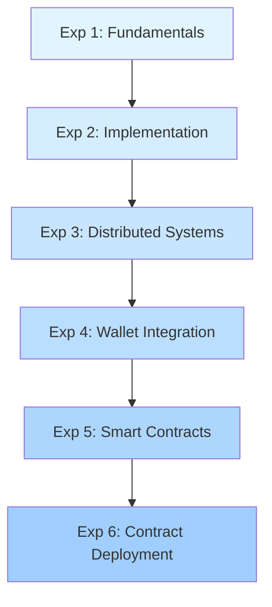

# 🔗 Blockchain Experiments

<div align="center">


### *Conducting blockchain experiments to explore decentralized systems, smart contracts, security, scalability, transparency, and real-world applications.*

</div>

---

## 📋 Overview

This repository contains a comprehensive collection of **blockchain experiments** designed to provide hands-on experience with blockchain technology fundamentals, cryptocurrency implementation, smart contract development, and decentralized application architecture.

From cryptographic foundations to production-ready decentralized networks, each experiment builds upon previous concepts to create a complete understanding of blockchain ecosystems.

---

## 🎯 Learning Objectives

Throughout these experiments, you will:

- ✅ Master **cryptographic hashing** and **proof-of-work** algorithms
- ✅ Build **complete blockchain implementations** from scratch
- ✅ Create **decentralized cryptocurrency networks**
- ✅ Develop **smart contracts** using Solidity
- ✅ Understand **wallet integration** and transaction management
- ✅ Explore **consensus mechanisms** and distributed systems
- ✅ Implement **REST APIs** for blockchain interaction
- ✅ Deploy applications on **Ethereum blockchain**

---

## 🧪 Experiments

<table>
<tr>
<td width="50%" valign="top">

### 🔐 [Experiment 1: Blockchain Fundamentals](./Experiment%201)
**Cryptographic Hashing & Merkle Trees**

Dive into the mathematical foundations of blockchain technology through implementation of SHA-256 hashing, proof-of-work mining, and Merkle tree data structures.

**Topics Covered:**
- SHA-256 cryptographic hashing
- Proof-of-work mining algorithms
- Nonce discovery and difficulty
- Merkle tree construction
- Transaction verification

**Technologies:**
- Python 3.8+
- Jupyter Notebook
- hashlib library

**Key Concepts:**
- Hash functions
- Mining puzzles
- Data integrity
- Transaction verification

</td>
<td width="50%" valign="top">

### ⛓️ [Experiment 2: Blockchain Implementation](./Experiment%202)
**Complete Blockchain with REST API**

Build a fully functional blockchain with transaction management, proof-of-work consensus, and a Flask-based REST API for interaction.

**Topics Covered:**
- Blockchain data structures
- Transaction mempool
- Mining algorithms
- Chain validation
- REST API development

**Technologies:**
- Python 3.8+
- Flask framework
- JSON serialization

**Key Concepts:**
- Block structure
- Transaction lifecycle
- API design
- Blockchain validation

</td>
</tr>

<tr>
<td width="50%" valign="top">

### 🌐 [Experiment 3: Hadcoin Cryptocurrency](./Experiment%203)
**Decentralized Cryptocurrency Network**

Create a multi-node cryptocurrency network with distributed consensus, peer-to-peer communication, and automatic chain synchronization.

**Topics Covered:**
- Multi-node architecture
- P2P networking
- Consensus protocols
- Mining rewards
- Chain synchronization

**Technologies:**
- Python 3.8+
- Flask REST API
- Requests library
- Network protocols

**Key Concepts:**
- Decentralization
- Longest chain rule
- Node discovery
- Network consensus

</td>
<td width="50%" valign="top">

### 🦊 [Experiment 4: MetaMask Integration](./Experiment%204)
**Ethereum Wallet & dApp Gateway**

Explore cryptocurrency wallet functionality, network management, and decentralized application integration through MetaMask.

**Topics Covered:**
- Wallet installation & setup
- Account management
- Network configuration
- Transaction sending
- dApp connections

**Technologies:**
- MetaMask extension
- Ethereum networks
- Web3 integration

**Key Concepts:**
- Private/public keys
- Seed phrases
- Gas fees
- dApp interaction

</td>
</tr>

<tr>
<td width="50%" valign="top">

### 📜 [Experiment 5: Solidity Smart Contracts](./Experiment%205)
**Ethereum Development with Solidity**

Master smart contract development with comprehensive coverage of Solidity programming, from basic syntax to advanced patterns.

**Topics Covered:**
- Solidity language fundamentals
- Data types & structures
- Functions & modifiers
- State management
- Transaction handling
- Gas optimization

**Technologies:**
- Solidity 0.8+
- Remix IDE
- Ethereum Virtual Machine

**Key Concepts:**
- Smart contracts
- EVM execution
- Storage patterns
- Security practices

</td>
<td width="50%" valign="top">

### 🗳️ [Experiment 6: Smart Contract Deployment](./Experiment%206)
**CampusBudgetAllocator — Voting & Transactions**

Create and deploy a real-world smart contract that implements weighted voting and proportional budget distribution for campus club funding.

**Topics Covered:**
- `require` statement guards
- `mapping`, `storage`, `memory` keywords
- `bytes32` vs `string` tradeoffs
- Struct-based data modeling
- Delegation chains & loop detection
- Proportional budget formula

**Technologies:**
- Solidity 0.8+
- Remix IDE
- Ethereum Virtual Machine

**Key Concepts:**
- Access control
- Vote delegation
- State management
- On-chain budget allocation

</td>
</tr>

<tr>
<td colspan="2" valign="top">

### 📊 **Experiment Progression**



**Learning Path:**
1. **Theory** → Cryptography & Hashing
2. **Practice** → Build Blockchain
3. **Network** → Distributed Systems
4. **Integration** → Real-world Tools
5. **Development** → Smart Contracts
6. **Deployment** → Contract Transactions

</td>
</tr>
</table>

---

## 🚀 Quick Start

### Prerequisites

```bash
# Python 3.8 or higher
python --version

# pip package manager
pip --version
```

### Installation

```bash
# Clone the repository
git clone https://github.com/yourusername/blockchain-experiments.git
cd blockchain-experiments

# Install dependencies
pip install flask requests jupyter notebook
```

### Running Experiments

**Experiment 1 - Jupyter Notebook:**
```bash
cd "Experiment 1"
jupyter notebook Blockchain_Lab_1.ipynb
```

**Experiment 2 - Flask Blockchain:**
```bash
cd "Experiment 2"
python blockchain_exp_2.py
```

**Experiment 3 - Multi-Node Network:**
```bash
cd "Experiment 3"
# Terminal 1
python hadcoin_node_5001.py
# Terminal 2
python hadcoin_node_5002.py
# Terminal 3
python hadcoin_node_5003.py
```

**Experiment 4 - MetaMask:**
- Install MetaMask browser extension
- Follow PDF documentation

**Experiment 5 - Solidity:**
- Open [Remix IDE](https://remix.ethereum.org)
- Import files from `blockchain_exp5_solidity` folder

**Experiment 6 - Smart Contract Deployment:**
- Open [Remix IDE](https://remix.ethereum.org)
- Load `CampusBudgetAllocator.sol`
- Compile and deploy with club names + treasury pool

---

## 🛠️ Technologies Used

<div align="center">

| Technology | Purpose | Version |
|------------|---------|---------|
|  | Core programming language | 3.8+ |
|  | REST API framework | 0.12.2+ |
|  | Smart contract language | 0.8+ |
|  | Blockchain platform | Mainnet/Testnets |
|  | Web3 wallet | Latest |
|  | Interactive notebooks | Latest |

</div>

---

## 📚 Core Concepts Covered

### 🔐 Cryptography & Security
- **SHA-256 Hashing**: One-way cryptographic functions
- **Digital Signatures**: Transaction authentication
- **Public/Private Keys**: Asymmetric cryptography
- **Merkle Trees**: Efficient data verification

### ⛓️ Blockchain Architecture
- **Block Structure**: Headers, transactions, hashing
- **Chain Linking**: Cryptographic connections
- **Immutability**: Tamper-proof records
- **Genesis Block**: Chain initialization

### 🤝 Consensus Mechanisms
- **Proof-of-Work (PoW)**: Computational puzzles
- **Longest Chain Rule**: Consensus protocol
- **Mining Process**: Block creation and validation
- **Difficulty Adjustment**: Network security

### 🌐 Distributed Systems
- **P2P Networks**: Peer-to-peer communication
- **Node Discovery**: Network topology
- **Chain Synchronization**: State consistency
- **Byzantine Fault Tolerance**: Malicious actor resistance

### 💰 Cryptocurrency
- **Transaction Management**: Creation and validation
- **Mining Rewards**: Economic incentives
- **Mempool**: Transaction queuing
- **UTXO/Account Models**: Balance tracking

### 📜 Smart Contracts
- **Solidity Programming**: EVM language
- **Contract Deployment**: On-chain code
- **State Management**: Storage patterns
- **Gas Optimization**: Cost efficiency

---

## 📊 Project Structure

```
Blockchain_Experiments_Atharva_Lotankar_20/
│
├── Experiment 1/                    # Blockchain Fundamentals
│   ├── Blockchain_Lab_1.ipynb      # Interactive notebook
│   ├── Blockchain_Lab_1.pdf        # Documentation
│   └── README.md                   # Experiment guide
│
├── Experiment 2/                    # Blockchain Implementation
│   ├── blockchain_exp_2.py         # Python implementation
│   ├── Blockchain_Lab_2.ipynb      # Notebook version
│   ├── Blockchain_Lab_2.docx.pdf   # Documentation
│   └── README.md                   # Experiment guide
│
├── Experiment 3/                    # Hadcoin Cryptocurrency
│   ├── hadcoin_node_5001.py        # Node 1
│   ├── hadcoin_node_5002.py        # Node 2
│   ├── hadcoin_node_5003.py        # Node 3
│   ├── Blockchain_Lab_3.pdf        # Documentation
│   └── README.md                   # Experiment guide
│
├── Experiment 4/                    # MetaMask Integration
│   ├── Experiment 4 - MetaMask.pdf # Complete guide
│   └── README.md                   # Experiment guide
│
├── Experiment 5/                    # Solidity Smart Contracts
│   ├── blockchain_exp5_solidity/   # Solidity lessons
│   │   ├── 1. Introduction/
│   │   ├── 2. Basic Syntax/
│   │   ├── 3. Primitive Data Types/
│   │   ├── 4. Variables/
│   │   ├── 5.1-5.4 Functions/
│   │   ├── 6. Visibility/
│   │   ├── 7.1-7.2 Control Flow/
│   │   ├── 8.1-8.4 Data Structures/
│   │   ├── 9. Data Locations/
│   │   ├── 10.1-10.3 Transactions/
│   │   └── README.md
│   ├── Blockchain_Lab_5.pdf        # Documentation
│   └── README.md                   # Experiment guide
│
├── Experiment 6/                    # Smart Contract Deployment
│   ├── CampusBudgetAllocator.sol   # Voting & budget allocation contract
│   ├── Blockchain_Lab_6 - Atharva Lotankar(D20C_20).pdf  # Documentation
│   └── README.md                   # Experiment guide
│
└── README.md                        # This file
```

---

## 🎓 Learning Outcomes

By completing these experiments, you will:

### Technical Skills
- ✅ Implement blockchain algorithms from scratch
- ✅ Build distributed cryptocurrency networks
- ✅ Develop smart contracts in Solidity
- ✅ Create REST APIs for blockchain interaction
- ✅ Deploy applications on Ethereum

### Conceptual Understanding
- ✅ Cryptographic foundations of blockchain
- ✅ Consensus mechanism design
- ✅ Distributed system architecture
- ✅ Economic incentive structures
- ✅ Security best practices

### Practical Experience
- ✅ Hands-on blockchain development
- ✅ Multi-node network setup
- ✅ Smart contract deployment
- ✅ Wallet integration
- ✅ Real-world testing

---

## 🔍 Key Features

### 🎯 Comprehensive Coverage
- From basics to advanced concepts
- Theory + practical implementation
- Multiple programming paradigms

### 💻 Production-Ready Code
- Well-documented implementations
- Security best practices
- Optimized algorithms

### 🌐 Real-World Applications
- Working cryptocurrency network
- Smart contract examples
- Wallet integration

### 📖 Educational Resources
- Detailed READMEs for each experiment
- Interactive Jupyter notebooks
- Complete documentation

---

## 🚧 Use Cases & Applications

### Cryptocurrency
- Digital currencies
- Payment systems
- Mining operations

### DeFi (Decentralized Finance)
- Lending protocols
- Decentralized exchanges
- Automated market makers

### NFTs (Non-Fungible Tokens)
- Digital art platforms
- Collectibles marketplaces
- Gaming assets

### Supply Chain
- Product tracking
- Authenticity verification
- Transparency systems

### Identity Management
- Digital identity
- Credential verification
- Access control

### Healthcare
- Medical records
- Drug traceability
- Patient data management

---

## 📖 Additional Resources

### Official Documentation
- [Bitcoin Whitepaper](https://bitcoin.org/bitcoin.pdf) - Original blockchain paper by Satoshi Nakamoto
- [Ethereum Whitepaper](https://ethereum.org/en/whitepaper/) - Smart contract platform
- [Solidity Documentation](https://docs.soliditylang.org/) - Smart contract language

### Learning Platforms
- [Ethereum.org Developer Portal](https://ethereum.org/en/developers/)
- [CryptoZombies](https://cryptozombies.io/) - Interactive Solidity tutorial
- [Ethernaut](https://ethernaut.openzeppelin.com/) - Security challenges

### Tools & Frameworks
- [Remix IDE](https://remix.ethereum.org/) - Browser-based Solidity IDE
- [Hardhat](https://hardhat.org/) - Ethereum development environment
- [Truffle Suite](https://trufflesuite.com/) - Smart contract development
- [Ganache](https://trufflesuite.com/ganache/) - Local blockchain

### Community
- [Ethereum Stack Exchange](https://ethereum.stackexchange.com/)
- [r/ethdev](https://reddit.com/r/ethdev) - Ethereum developers
- [Blockchain Discord Servers](https://discord.gg/ethereum)

---

## 🤝 Contributing

Contributions are welcome! Feel free to:

- 🐛 Report bugs
- 💡 Suggest new experiments
- 📝 Improve documentation
- 🔧 Submit pull requests

---

## 📜 License

This project is created for educational purposes. Individual components may have their own licenses:

- Code examples: MIT License
- Documentation: CC BY 4.0
- Third-party libraries: See respective licenses

---

## 👨‍💻 Author

**Atharva Lotankar**

Blockchain researcher and developer passionate about decentralized technologies, cryptography, and distributed systems.

---

## 🙏 Acknowledgments

Special thanks to:
- **Satoshi Nakamoto** - For inventing Bitcoin and blockchain technology
- **Vitalik Buterin** - For creating Ethereum
- **Open-source community** - For making blockchain accessible
- **Educational institutions** - For fostering blockchain research

---

## 📞 Contact & Support

For questions, discussions, or collaboration:

- 📧 Email: [Your Email]
- 💼 LinkedIn: [Your LinkedIn]
- 🐱 GitHub: [Your GitHub]
- 🐦 Twitter: [Your Twitter]

---

<div align="center">

## 🌟 Experiment Status

| Experiment | Status | Difficulty | Duration |
|------------|--------|------------|----------|
| **Experiment 1** | ✅ Complete | ⭐⭐ Beginner | 2-3 hours |
| **Experiment 2** | ✅ Complete | ⭐⭐⭐ Intermediate | 3-4 hours |
| **Experiment 3** | ✅ Complete | ⭐⭐⭐⭐ Advanced | 4-5 hours |
| **Experiment 4** | ✅ Complete | ⭐⭐ Beginner | 1-2 hours |
| **Experiment 5** | ✅ Complete | ⭐⭐⭐⭐ Advanced | 5-6 hours |
| **Experiment 6** | ✅ Complete | ⭐⭐⭐ Intermediate | 2-3 hours |

---

### 🎉 All Experiments Completed Successfully!

*From cryptographic fundamentals to smart contract creation and deployment - A complete blockchain journey!*

---

[](https://github.com/yourusername/blockchain-experiments)
[](https://github.com/yourusername/blockchain-experiments/fork)
[](https://github.com/yourusername/blockchain-experiments/issues)

**Made with ❤️ and ⛓️ for the blockchain community**

</div>
